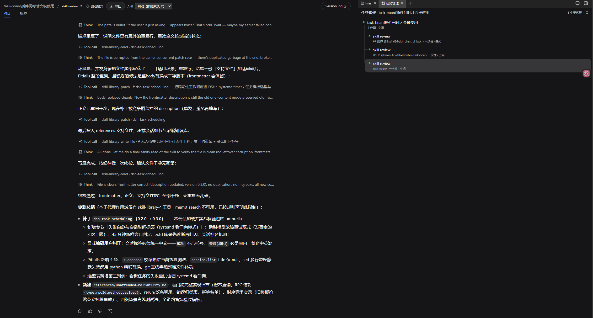
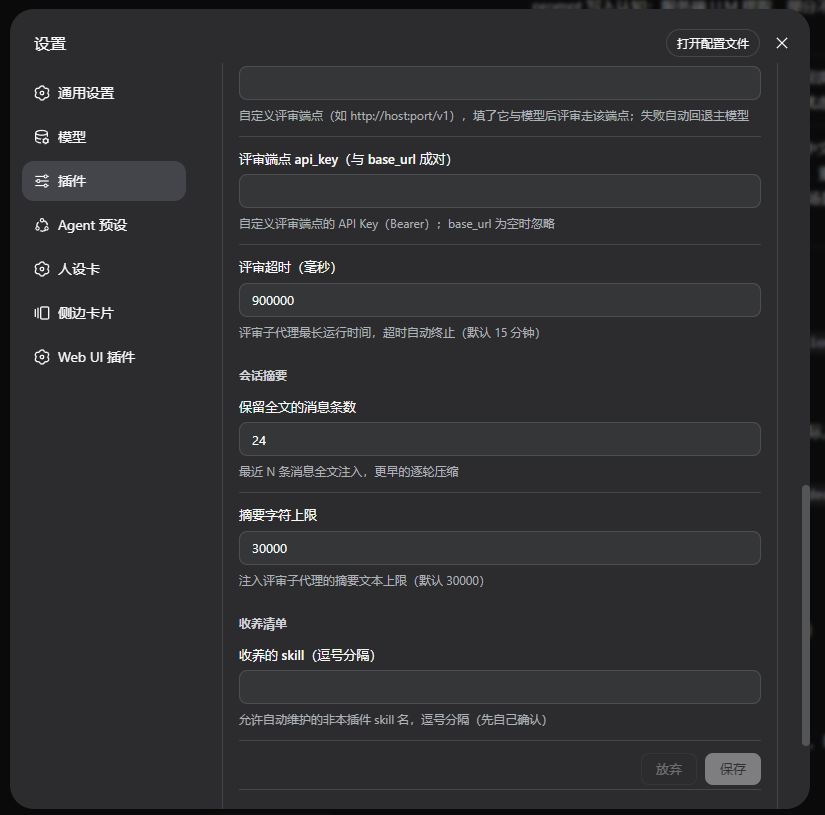

# dsh-skill-curator — 自动技能策展插件

> **仓库简介**：DeepSeek Harness 自动技能策展插件——后台评审子代理定期复盘对话，自动创建/更新 SKILL.md，让智能体在真实使用中持续自我进化，零侵入、不改 dsh 源码。

为 [DeepSeek Harness](https://github.com/deepseek-ai/deepseek-harness) 开发的自动技能策展 bundle 插件：每 N 轮真实对话（默认 **3**），后台起一个**评审子代理**阅读会话摘要，主动**创建/更新 `~/.dsh/skills/<name>/SKILL.md`**——把 Nous Research Hermes Agent 的「后台评审自我改进」闭环移植到 DSH，零侵入，不改 dsh 源码。

## 工作原理

```
回合结束 ──▶ agent/turn-stopping（scoped 监听，按 agent 计数）
    │ 满 3 轮？（skillNudgeInterval）
    ▼
异步 fire-and-forget（绝不阻塞回合关闭）
    ▼
构建会话摘要 ──▶ 最近 N 条全文 + 更早逐轮压缩
    ▼
起子代理（provider: spawn），注入摘要 + 评审指令
    │  toolFilter allow = 仅 skill-library-*（hermes 式白名单）
    ▼
子代理阅读并写盘 ~/.dsh/skills/<name>/SKILL.md（正文中文、description 双语）
    │  frontmatter 盖 author: dsh-skill-curator（产权标记）
    ▼
摘要写入宿主日志 + 设置卡片「最近评审」面板可见
```



*评审子代理以任务形式出现在右侧「任务管理」面板，图中可见正在排队/空闲的 `skill review` 任务，可实时观察策展全过程。*

手动触发：`/skill-refine [关注点]` 立即对当前会话发起一次评审。

## 关键设计（对照 hermes）

| hermes | dsh-skill-curator |
|---|---|
| turn_finalizer 计数（10 轮） | scoped `agent/turn-stopping` 计数（默认 3，可配） |
| daemon 线程 fork AIAgent | 平台子代理（ctx.subagents.start）——UI 可见、会话完全隔离 |
| 全量回放会话（吃前缀缓存） | 摘要注入（尾 N 条全文 + 更早压缩）——DSH 无缓存优势 |
| 运行时工具白名单 | toolFilter.allow 白名单 + 提示词约束 |
| curator 产权标记 | frontmatter `author: dsh-skill-curator` + skill-library-adopt |
| /refine | /skill-refine 命令 |

行为对照矩阵详见 [docs/COMPARISON.md](docs/COMPARISON.md)。

## 安装

```bash
cd /path/to/dsh-skill-curator
dsh plugin --profile web add ./
# 重启 dsh，然后在 设置 → 插件 页签 → 「技能策展（Skill Curator）」卡片 里启用
```

标准 bundle 插件，装/卸后重启生效；全程不改 dsh 源码。

## 设置项（设置页 · 插件页签 · 「技能策展」卡片）

| 设置卡（上） | 设置卡（下） |
|:---:|:---:|
|  |  |

- **enabled** 总开关（默认开）
- **skillNudgeInterval** 触发间隔（默认 3 轮）
- **notifyMode** off=静默 / on=宿主日志摘要 / verbose=含内容预览（分段按钮）
- **reviewProvider / reviewModel** 评审子代理模型覆盖（留空 = 跟随主会话当前模型）
- **reviewBaseUrl / reviewApiKey** 自定义评审端点（OpenAI 兼容 `/chat/completions`）。
  填了 base_url + 模型后，评审子代理经专用适配器路由跑在该端点（路由名 = `reviewProvider`，
  缺省 `skill-curator-review`）；端点与凭据每次请求现读设置，改动即时生效无需重启。
  仅 base_url 为空时忽略 api_key
- **最近评审记录** 持久化于 `~/.dsh/skill-curator/reviews.json`（保留最近 50 条），卸载/重装/重启不丢失
- **评审韧性（两层）**：针对端点/模型层失败（HTTP 错误 / 断网 / 鉴权失败 / 限流 / 模型缺失 / 超时）——
  ① 自定义端点失败时，自动以主会话模型**重跑一次**（回退在宿主日志、评审记录与状态面板「⚠️已回退主模型」均有标记）；
  ② 最终尝试又因连接类错误/无详情的 killed 失败时，按 `reviewRetryCount` 上限退避重试（默认 1 次），
  主模型瞬断不再直接丢失本次评审。工具层报错一律不重试
- **reviewTimeoutMs** 评审预算（默认 15 分钟，超时自动终止）
- **reviewRetryCount** 最终尝试失败后的额外重试次数（0=完全不重试；默认 1）
- **reviewRetryDelayMs** 重试退避基数：第 n 次重试等待 = 基数 × n 毫秒（默认 5000）
- **digestTail / digestMaxChars** 摘要形态
- **adoptSkills** 收养清单（逗号分隔）：允许自动维护的非本插件 skill

## 技能库工具（白名单）

评审子代理只能调这六个工具（主会话也可直接用）：

| 工具 | 用途 |
|---|---|
| `skill-library-list` | 列技能（名称/描述/是否托管） |
| `skill-library-read` | 读单个 SKILL.md |
| `skill-library-create` | 新建类级 umbrella 技能（中文正文 + 双语描述） |
| `skill-library-patch` | 定点 `oldString→newString` 或全文替换（保留 frontmatter） |
| `skill-library-write-file` | 写 `references/` `templates/` `scripts/` 支持文件 |
| `skill-library-adopt` | 收养未托管技能（盖 author 章） |

产权守卫：只有 frontmatter 盖 `author: dsh-skill-curator` 章或列入 adoptSkills 的 skill 才能被修改，其余一律拒绝并明确提示「先收养」。路径全部越界校验，写盘原子（tmp + rename）。

## 环境要求

```jsonc
// package.json（机器可读）
"engines": { "node": ">=22" },
"dependencies": {
  "@deepseek-ai/dsh-llm": "^0.1.5-rc.1",
  "@deepseek-ai/dsh-settings": "^0.1.5-rc.1",
  "@deepseek-ai/dsh-subagent": "^0.1.5-rc.1",
  "@deepseek-ai/dsh-tools": "^0.1.5-rc.1",
  "@deepseek-ai/schemastery": "^3.18.2"
},
"dsh": { "engines": { "dsh": ">=0.1.2-alpha.3 <0.2.0 || >=0.1.5-alpha.1 <0.1.6" } }
```

- **已验证宿主**：`@deepseek-ai/dsh 0.1.5-rc.1`（Node v24）。
- **区间里的析取是承重的**：npm semver 只从「区间组自身含同 `[major,minor,patch]` 元组预发布」的组满足预发布，故单区间 `<0.2.0` 那组**覆盖不了** `0.1.5-rc.1`。`test/entry.test.mjs` 用 10 行判定表 + 反证（改回旧区间即红）+ 宿主真实 `semver.satisfies` 交叉验证钉住。
- **无安装脚本、禁 gyp/原生编译**：全树纯 ESM，`test/entry.test.mjs` 守护（无 `install`/`postinstall`/`prepare`、无 `optionalDependencies`、依赖面仅 `@deepseek-ai/*`）。

## 开发

```bash
pnpm install                # 部分环境需带代理/独立 cache（默认 npm cache 可能不可写）
npm test                    # entry + 单测 + smoke + client-smoke 全量
node test/entry.test.mjs    # 入口直载、manifest、engines 区间、键集合一致性、依赖卫生
node test/smoke.mjs         # 模块/工具/白名单冒烟
node test/client-smoke.mjs  # client bundle 冒烟（真实执行组件树）
```

`docs/EVIDENCE.md` 记录隔离实例的安装/启动/真机验证（一次性 `DSH_HOME`，不碰任何已部署实例）；`docs/AUDIT.md` 记录各轮审计。

## License

MIT